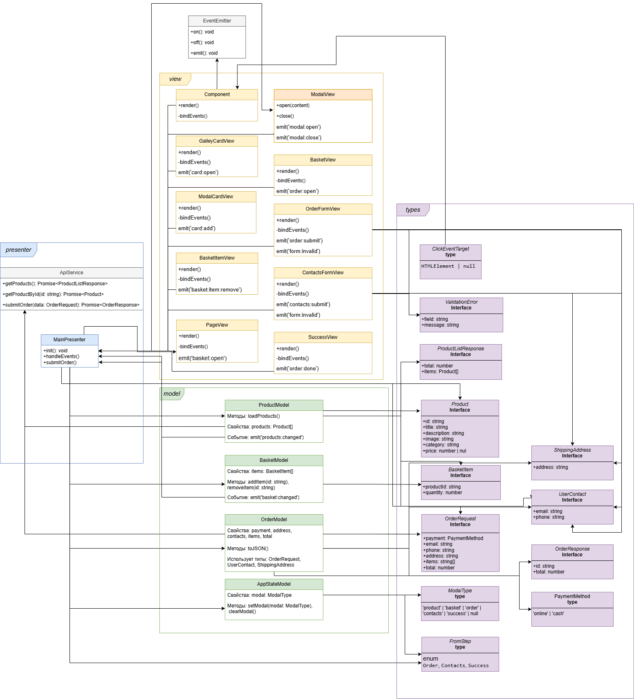

# Проектная работа "Веб-ларек"

Стек: HTML, SCSS, TS, Webpack

Структура проекта:
- src/ — исходные файлы проекта
- src/components/ — папка с JS компонентами
- src/components/base/ — папка с базовым кодом

Важные файлы:
- src/pages/index.html — HTML-файл главной страницы
- src/types/index.ts — файл с типами
- src/index.ts — точка входа приложения
- src/scss/styles.scss — корневой файл стилей
- src/utils/constants.ts — файл с константами
- src/utils/utils.ts — файл с утилитами

## Установка и запуск
Для установки и запуска проекта необходимо выполнить команды

```
npm install
npm run start
```

или

```
yarn
yarn start
```
## Сборка

```
npm run build
```

или

```
yarn build
```
---


## Архитектура проекта Web-Ларёк

### Используемый паттерн
Проект построен по архитектуре **MVP (Model–View–Presenter)**, которая позволяет чётко разделить работу с данными, отображением и логикой взаимодействия. Все части приложения обмениваются сообщениями через EventEmitter — это делает поведение компонентов предсказуемым и облегчает масштабирование. **EventEmitter**.

---

## Основные компоненты архитектуры

### EventEmitter
**Класс EventEmitter** обеспечивает работу событийной системы. 

**Функции:**
- `on()` — подписка на событие
- `off()` — удаление подписки
- `emit()` — вызов события с передачей данных

EventEmitter используется для связи между всеми слоями приложения: пользовательские действия, изменения данных, ошибки и т.д.

---

## Обработка ошибок и крайних случаев

### Обработка ошибок API

При возникновении ошибок при работе с API (например, при загрузке каталога или отправке заказа), они обрабатываются через вывод сообщения в консоль с помощью `console.error()`.

### Обработка `price: null`

Поле `price` в объекте `Product` может быть `null`, если цена товара не указана. В этом случае в интерфейсе отображается:

- Если цена указана — например: `1000 синапсов`
- Если `price === null` — отображается как **«Бесценно»**


### Поведение кнопок и работа с бесценными товарами

#### Поведение кнопки "В корзину"

- Бесценные товары `(price === null)` не могут быть добавлены в корзину.
- Кнопка "В корзину" для таких товаров неактивна.
- При расчете общей стоимости заказа бесценные товары игнорируются.

#### Проверка возможности оформления заказа

- Кнопка оформления заказа недоступна, если общая сумма заказа равна 0.
- Это предотвращает отправку пустого массива товаров на сервер.

---

## Типы и интерфейсы

Для описания структуры данных, приходящих с сервера и используемых внутри приложения, заданы следующие интерфейсы и типы в файле `src/types/index.ts`.

### Интерфейсы данных

#### `Product`
**Описывает структуру одного товара из каталога.**
```ts
interface Product {
  id: string;
  title: string;
  description: string;
  image: string;
  category: string;
  price: number | null;
}
```

#### `ProductListResponse`
**Ответ от API со списком товаров.**
```ts
interface ProductListResponse {
  total: number;
  items: Product[];
}
```

#### `BasketItem`
**Объект, отображающий товар в корзине.**
```ts
interface BasketItem {
  productId: string;
  quantity: number;
}
```

#### `OrderRequest` и `OrderResponse`
**Формат отправки и получения данных при оформлении заказа.**
```ts
interface OrderRequest {
  payment: string;
  email: string;
  phone: string;
  address: string;
  items: string[];
  total: number;
}

interface OrderResponse {
  id: string;
  total: number;
}
```

#### `UserContact`
**Данные покупателя.**
```ts
interface UserContact {
  email: string;
  phone: string;
}
```

#### `ShippingAddress`
**Адрес доставки.**
```ts
interface ShippingAddress {
  address: string;
}
```

#### `ValidationError`
**Структура ошибки валидации форм.**
```ts
interface ValidationError {
  field: string;
  message: string;
}
```

---

### Дополнительные типы

#### `PaymentMethod`
**Допустимые способы оплаты.**
```ts
type PaymentMethod = 'online' | 'cash';
```

#### `ModalType`
**Типы модальных окон.**
```ts
type ModalType = 'product' | 'basket' | 'order' | 'contacts' | 'success' | null;
```

#### `FormStep`
**Этапы формы оформления заказа.**
```ts
enum FormStep {
  Order,
  Contacts,
  Success
}
```

#### `ClickEventTarget`
**Тип для `event.target` при обработке событий клика.**
```ts
type ClickEventTarget = HTMLElement | null;
```
---

## Описание событий

В проекте используется событийная архитектура: компоненты взаимодействуют между собой через `EventEmitter`, не создавая жёстких зависимостей. Ниже приведён список ключевых событий и их назначения.

| Событие            | Генерируется...                  | Назначение                                                                 |
|--------------------|----------------------------------|----------------------------------------------------------------------------|
| `products:changed` | `ProductModel`                   | Обновление каталога товаров (после загрузки с сервера)                    |
| `basket:changed`   | `BasketModel`                    | Обновление корзины (добавление/удаление товара)                          |
| `card:add`         | `ModalCardView`                | Добавление товара в корзину                                               |
| `card:open`        | `GalleryCardView`                | Открытие карточки товара в модальном окне                                 |
| `basket:open`      | `PageView`   | Открытие корзины                                                           |
| `modal:open`       | `ModalView`          | Отображение модального окна                                               |
| `modal:close`      | `ModalView`                      | Закрытие модального окна                                                  |
| `order:open`      | `BasketView`                      | Начало оформления заказа                                                  |
| `order:submit`     | `OrderFormView`                  | Отправка формы с адресом и способом оплаты                                |
| `contacts:submit`  | `ContactsFormView`               | Отправка контактной информации                                            |
| `form:invalid`     | `OrderFormView` / `ContactsFormView` | Отображение ошибок валидации                                         |
| `order:success`    | `MainPresenter`              | Заказ успешно оформлен, переход к `SuccessView`                           |
| `order:done`    | `SuccessView`              | Завершение процесса заказа (закрытие окна «Спасибо», очистка корзины)                           |

> Все слои приложения подписываются на нужные события и обрабатывают их соответствующими методами. Это позволяет масштабировать архитектуру и добавлять новый функционал.

---

## Модели (Model)

### ApiService
**Класс для работы с сервером. Реализует интерфейс `IApiService`.**
- `getProducts()` — загружает список товаров с сервера.
- `getProductById(id)` — получает информацию о товаре по ID.
- `submitOrder(data)` — отправляет заказ на сервер.
>`ApiService` инкапсулирует логику HTTP-запросов и использует базовый URL из .env. Класс применяется в моделях `ProductModel` и `OrderModel`.


### ProductModel
**Работает с каталогом товаров.**
- `loadProducts()` — загружает список товаров с API
-	`emit('products:changed')` — событие после успешной загрузки каталога

### BasketModel
**Отслеживает товары в корзине.**
- `addItem(productId)` — добавляет товар в корзину
-	`removeItem(productId)` — удаляет товар из корзины
-	`emit('basket:changed')` — событие при изменении содержимого корзины


### OrderModel
**Хранит данные текущего заказа.**
-	`toJSON()` — возвращает данные заказа для отправки на сервер
> (OrderModel содержит информацию об оформляемом заказе: выбранный способ оплаты, адрес доставки, контактные данные покупателя и список товаров. При изменении этих данных может выполняться проверка заполнения полей.)


### AppStateModel
**Хранит текущее состояние модального окна.**
- `setModal(modal: ModalType)` — устанавливает активное модальное окно (например, `'basket'`, `'order'`, `'success'`)

- `clearModal()` — сбрасывает текущее состояние модального окна (например, при закрытии или завершении заказа)

>`AppStateModel` используется презентером для управления модальным интерфейсом: открытия, переключения между шагами оформления и закрытия по завершении.

---

## Отображения (View)

### Component (базовый класс)
**Общий базовый класс для компонентов отображения (View).**
- Реализует интерфейс `IView`, содержащий методы `render()` и `bindEvents()`
- Предоставляет базовую реализацию этих методов или абстрактные заготовки

Методы:
- `render()` — базовый метод отрисовки элемента интерфейса
- `bindEvents()` — базовый метод для назначения обработчиков событий
Обеспечивает вспомогательные методы для работы с DOM и подписки на события через `EventEmitter`


Классы `View` (например, `GalleryCardView`, `ModalCardView`) наследуют `Component`, что позволяет избежать дублирования кода. Общая логика (например, вставка шаблона в DOM, навешивание обработчиков) реализована один раз в `Component` и используется во всех потомках.

### GalleryCardView
**Отображает карточку товара на главной странице (в каталоге).**
- `render()` — рендер карточки по шаблону
- `bindEvents()` — обработка кликов (на открытие карточки в модальном окне)
- `emit('card:open')`


Компонент `GalleryCardView` используется на главной странице для отображения товара в виде карточки-превью. При клике по этой карточке генерируется событие `card:open` для открытия подробного описания товара в модальном окне (через `ModalView`).

### ModalCardView
**Отображает карточку товара в модальном окне.**
- `render()` — рендер карточки товара
- `bindEvents()` — обработка кликов (добавление товара в корзину)
- `emit('card:add')`


`ModalCardView` показывает подробную информацию о товаре внутри модального окна. При нажатии кнопки «В корзину» компонент генерирует событие `card:add`, которое обрабатывается `MainPresenter` (добавление товара в корзину через `BasketModel`).

### PageView
**Управляет отображением главной страницы и шапки сайта (header).**
- `render()` — обновляет отображение количества товаров в корзине
- `bindEvents()` — обрабатывает клик по иконке корзины и генерирует событие `basket:open`
- `emit('basket:open')`


Компонент `PageView` используется для отображения статичных элементов страницы, таких как заголовок, логотип, кнопка корзины с индикатором количества товаров. Управляется через `MainPresenter`.

### BasketItemView
**Отображает отдельный товар в корзине.**
- `render()` —  рендер элемента корзины (товар с количеством и ценой)
- `bindEvents()` — обработка кликов (удаление этого товара из корзины)
- `emit('basket:item:remove')` — генерируется при клике на кнопку удаления


Компонент `BasketItemView` отвечает за представление товара внутри списка корзины: название, цена, количество и кнопка удаления. При клике на кнопку удаления, это событие перехватывает `MainPresenter`, удаляет товар из `BasketModel`, и обновлённое состояние корзины перерисовывается через `BasketView`.


### BasketView
**Отображает содержимое корзины.**
- `render()` — рендерит контейнер корзины (список товаров, кнопку оформления заказа, сумму)
- `bindEvents()` — обработка кликов (удаление товара, нажатие кнопки оформления заказа)
- `emit('order:open')`

`BasketView` обновляется при изменениях в `BasketModel` (реагирует на событие basket:changed). Нажатие на кнопку удаления товара передается презентеру, который вызывает обновление `BasketModel`. При нажатии на кнопку оформления заказа `BasketView` генерирует событие `order:open` — это начало процесса оформления заказа (открывается форма заказа).

### ModalView
**Универсальный компонент для модальных окон.**
- `open(content)` — открывает с переданным содержимым
- `close()` — закрывает
- `emit('modal:open')`, `emit('modal:close')`

ModalView работает как универсальный контейнер: я могу вставить туда любую часть интерфейса — от карточки товара до формы оформления. Это избавляет от дублирования кода и позволяет переиспользовать модалки в разных сценариях.

### OrderFormView
**Первая форма оформления заказа.**
- `render()` — отрисовка полей
- `bindEvents()` — отправка формы
- `emit('order:submit')`
- `emit('form:invalid')`

OrderFormView показывает поля доставки и оплаты. После проверки введённых данных (валидации) эта форма скрывается, и в модальном окне показывается следующая — `ContactsFormView`.

### ContactsFormView
**Вторая форма оформления заказа.**
- `render()` — email и телефон
- `bindEvents()` — отправка данных
- `emit('contacts:submit')`
- `emit('form:invalid')`

`ContactsFormView` отображается после успешного заполнения первой формы. После отправки контактной информации `MainPresenter` собирает все данные заказа и отправляет их на сервер.

### SuccessView
**Окно успешного заказа.**
- `render()` — отрисовка текста успеха и кнопки возврата
- `emit('order:done')`

После успешного оформления заказа `SuccessView` заменяет содержимое модального окна на сообщение благодарности и предоставляет пользователю кнопку для возврата к каталогу.

---

## Презентер (Presenter)

### MainPresenter
**Управляет главной страницей, корзиной и процессом оформления заказа.**
- `init()` — связывает `ProductModel`, `GalleryCardView`, `ModalCardView` `BasketModel`, `BasketView`, `ModalView`, `OrderModel`, `AppStateModel`, `OrderFormView`, `ContactsFormView`, `SuccessView`
- Обрабатывает события: открытие карточки, обновление корзины, открытие/закрытие модального окна, отправку форм, успешное завершение заказа

Пример: после заполнения всех полей и нажатия кнопки «Оплатить» `MainPresenter` отправляет заказ на сервер `(submitOrder())`, а затем отображает `SuccessView` в `ModalView`. После этого корзина очищается, и пользователь может продолжить покупки

---

## Связи между компонентами

`MainPresenter` получает данные из `ProductModel`, обновляет `BasketModel`, открывает `ModalView`, рендерит:
- `GalleryCardView` — карточки товаров в каталоге;
- `ModalCardView` — карточку товара в модальном окне (по событию `card:open`);
- `BasketView` — контейнер корзины, который включает в себя список `BasketItemView`;
- `OrderFormView`, `ContactsFormView` и `SuccessView` — шаги оформления заказа.
- Обрабатывает событие `basket:item:remove` (удаление товара из корзины)


Все компоненты используют `EventEmitter` для реагирования на действия пользователя и обмена данными между слоями приложения. Это делает архитектуру гибкой и масштабируемой.


---


Схема архитектуры оформлена в draw.io и представлена в файле `uml.png`. Она иллюстрирует зависимости между моделями, отображениями и презентерами с подписями взаимодействий (например: `renders`, `opens modal`, `sets data`, `emits`).




Схема и ход работы доступны на Miro-доске, 
[Посмотреть схему в Miro](https://miro.com/app/board/uXjVIJ0J3Bc=/?share_link_id=312250903907)


